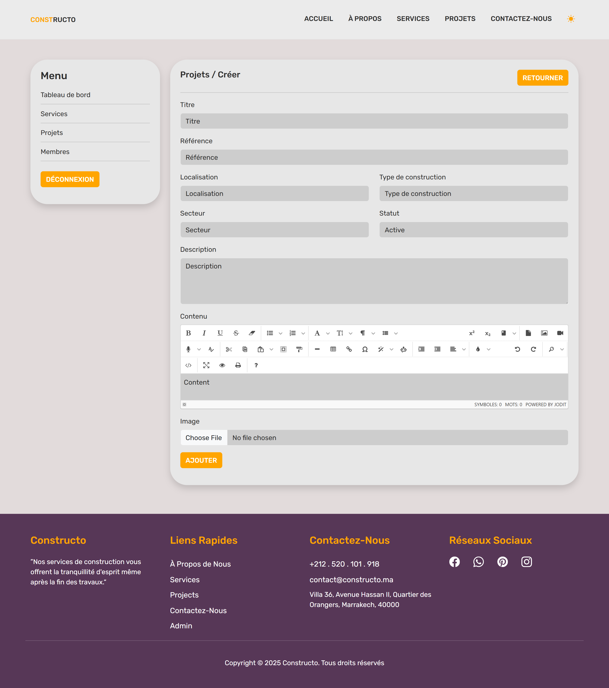
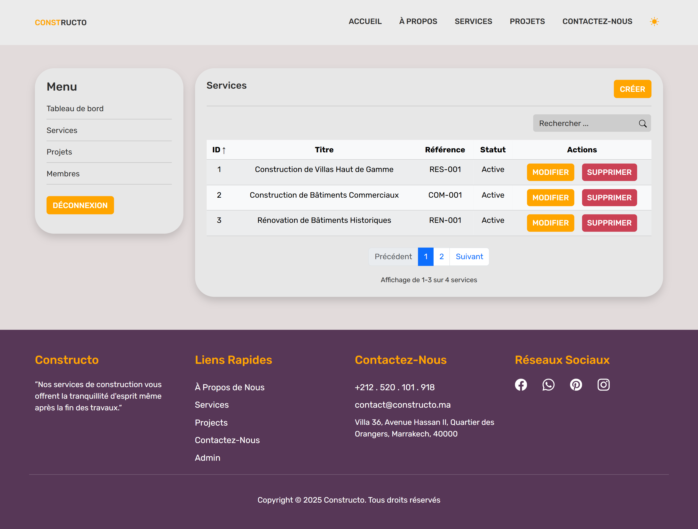
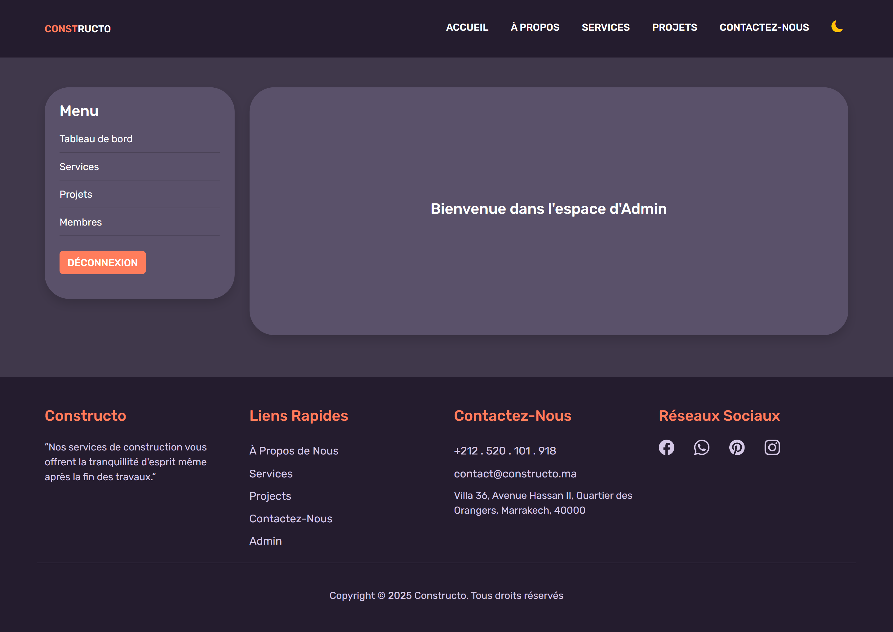

# Constructo 🏗️  
A web platform for the **Constructo** construction company with a public website and admin dashboard.

## 🛠 Tech Stack
- **Frontend:** React.js, Sass, Bootstrap  
- **Backend:** Laravel (PHP)  
- **Database:** MySQL  

## 🌐 Interfaces

### 🧑‍💼 Public Website
- Showcase company **projects**, **services**, and **team members**  
- **Contact form** for client inquiries  

### 🔐 Admin Dashboard
- Manage **projects**, **services**, **team members**  
- Secured access for administrators  

## 🚀 Installation

### 1. Clone Repo
```bash
git clone https://github.com/aymane-bouIjam/Project-Constructo.git
```

### 2. Backend (Laravel)
```bash
cd Project-Constructo/backend
composer install
cp .env.example .env
php artisan key:generate
php artisan migrate
php artisan serve
```

### 3. Frontend (React)
```bash
cd ../frontend
npm install
npm run dev
```

### 4. Configure Database
Edit `.env` in the Laravel project:
```env
DB_DATABASE=constructo_db
DB_USERNAME=root
DB_PASSWORD=your_password
php artisan migrate --seed
```
## 📸 Screenshots

### 🌐 Public Interface
**Landing Page**  


**Login Page**  


### 🛠 Admin Dashboard
**Create Project**  


**Manage Services**  


**Dark Mode**  


